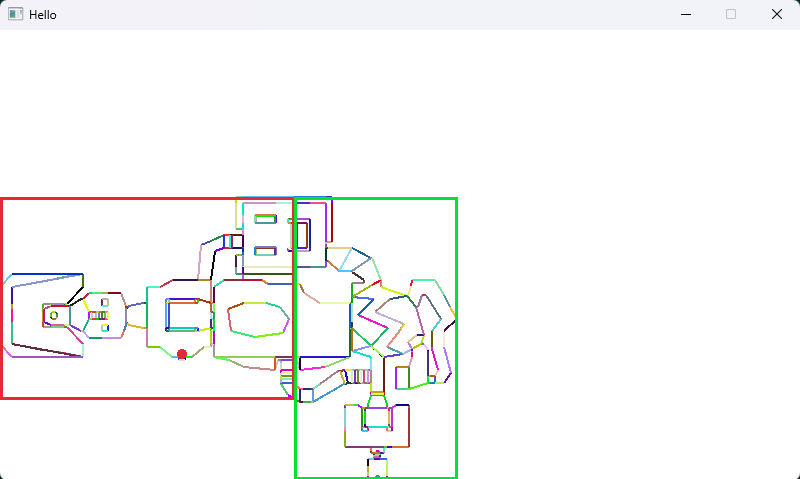

# Python DOOM WAD Renderer

A DOOM 1 WAD file parser and automap visualizer written in Python, following a C++ tutorial ported to Python with raylib.



## What it does

- Parses the DOOM 1 WAD binary format — header, directories, and map lumps
- Reads map geometry: vertices, linedefs, segs, subsectors, BSP nodes, and things
- Renders a full automap with linedefs in black and segs colored by subsector
- Visualizes BSP tree bounding boxes (red = right child, green = left child)
- Interactive BSP tree traversal — navigate the tree in real time with arrow keys
- Player position marker

## Requirements

- Python 3.x
- raylib (`pip install raylib`)
- A legal copy of `DOOM.WAD` placed in the `data/` folder

## How to run

```
pip install raylib
python main.py
```

## Controls

| Key | Action |
|-----|--------|
| Right arrow | Traverse to right child node |
| Left arrow | Traverse to left child node |
| Up arrow | Go back to parent node |

## Current state

Work in progress. WAD parsing and automap visualization are functional. No gameplay, no texture rendering, no 3D view yet.

## References

- [Doom Wiki — WAD format](https://doomwiki.org/wiki/WAD)
- [Doom Wiki — BSP](https://doomwiki.org/wiki/Node)
